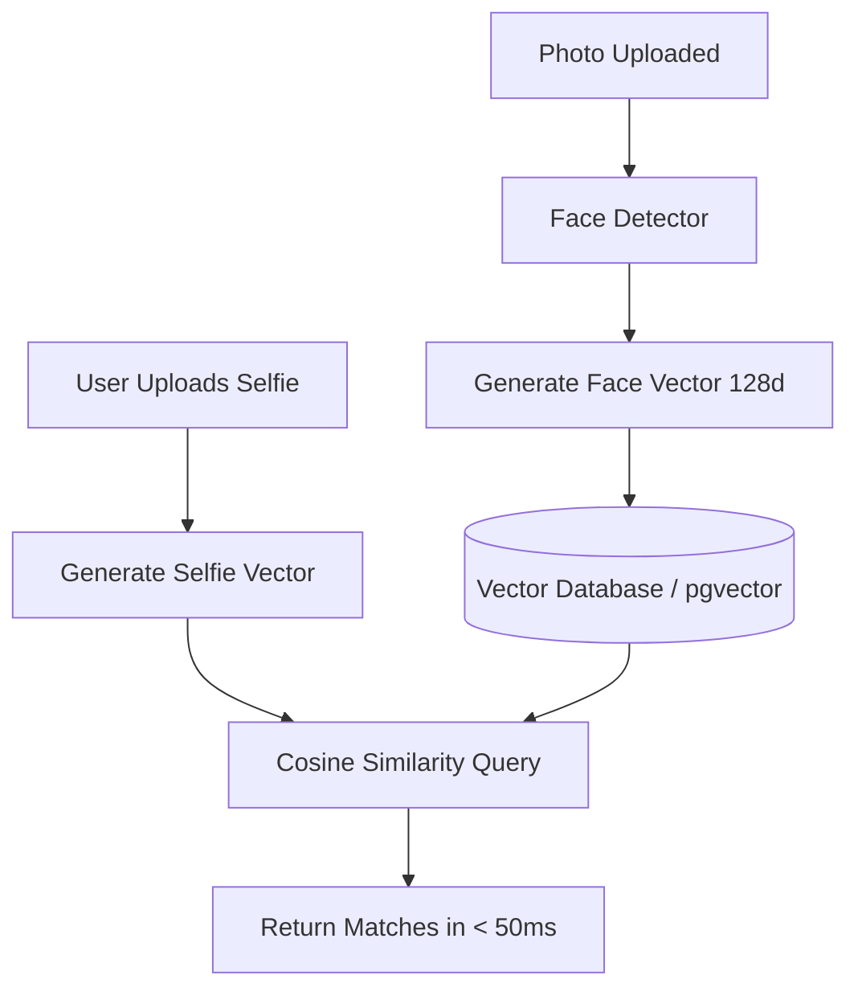
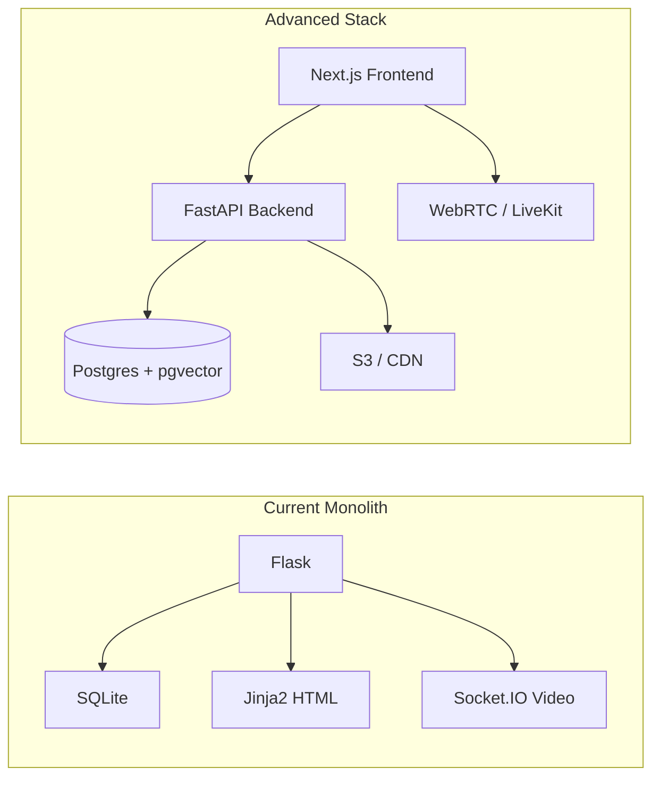

# EventSnap: Future Advancements & Roadmap

EventSnap already contains advanced core features—including AI face-matching, visual CLIP tagging, real-time Socket.IO streams, and automated MoviePy video reels. To take this project from a functional prototype to a scalable, production-grade application, several architectural and feature advancements can be implemented.

---

## 1. 🚀 Core Architectural Advancements

### AI Search Scaling: Vector Embeddings Database
* **Current Limitation**: The "Find My Photos" feature loops through every photo in an event gallery and calls `DeepFace.verify` against the user's selfie. This scales poorly ($O(N)$ matching complexity); if an event has 2,000 photos, the server will freeze running 2,000 deep learning checks.
* **Advancement**:
  * Extract face embeddings (a vector array of 128 or 512 dimensions) once when a photo is uploaded.
  * Store the vectors in a vector database or database extension like **pgvector** (PostgreSQL) or **Qdrant/Milvus**.
  * When a user uploads a selfie, calculate its vector and perform a **Cosine Similarity Search** in the database.
  * **Result**: Face matches take milliseconds instead of minutes.

### Live Streaming: Upgrade WebSockets to WebRTC
* **Current Limitation**: Streaming frames as base64 images over Socket.IO (`stream_frame`) has high bandwidth overhead and latency.
* **Advancement**:
  * Integrate **WebRTC** (Web Real-Time Communication) for audio and video feeds.
  * Use a media server (like Janus, Mediasoup, or LiveKit) to relay streams.
  * **Result**: Sub-second latency, standard HD video codecs (H.264/VP8), and highly optimized audio streaming.

### Storage & CDN Optimization
* **Current Limitation**: Files are written directly to local folders or mounted volumes, adding CPU disk load and slowing image delivery.
* **Advancement**:
  * Move upload folders to **Amazon S3** or **Cloudinary**.
  * Use a Content Delivery Network (CDN) like **CloudFront** to cache and deliver images globally.
  * Run asynchronous image optimization (generating WebP/AVIF formats and thumbnails) using a background task worker (like Celery + Redis).

---

## 2. ✨ Feature Advancements

| Feature | Current State | Proposed Advancement |
| :--- | :--- | :--- |
| **Reel Generator** | Basic vertical clip stitching. | **Beat-Synced Transitions**: Extract audio peaks from the background music and sync image transitions to the beat. |
| **AI Tagging** | Single CLIP prompt matches. | **Natural Language Search**: Let users search for images using full sentences like *"group of people wearing glasses on stage"*. |
| **Volunteer Uploads** | Requires constant internet. | **PWA Offline Queue**: A Progressive Web App that lets volunteers capture photos offline at events and auto-uploads them when connection returns. |
| **User Notifications** | None. | **Web Push Alerts**: Instantly notify viewers when a photo matching their face is uploaded to a gallery. |

---

## 3. 🛠️ Technology Migration Path

To support these advancements, the codebase would migrate towards a modern stack:

---

## 4. 🎨 Generative AI & Image Enhancements

* **AI Face Swapping & Party Filters**: Run lightweight generative diffusion models or GANs to allow users to apply event-themed filters or generate stylized cartoon versions of themselves.
* **Auto-Enhance (Super Resolution)**: Integrate an upscaling model (like **Real-ESRGAN**) to automatically restore low-quality, dark, or blurry webcam photos to high-definition 4K resolution before downloading.
* **AI Image Outpainting (Uncropping)**: Utilize Generative Fill APIs so that users can "uncrop" photos that were cropped too tightly, extending the background intelligently.

---

## 5. 🔒 Privacy, Monetization & Compliance

* **GDPR-Compliant Face Blurring**: Grant users the right to privacy. The AI automatically detects their face and applies a blur across *all* public galleries if they opt out of photo sharing.
* **Watermarking & Paywalls (Stripe Integration)**: Auto-apply customizable overlays to high-res event photos. Viewers can purchase digital downloads of their matched photos, processing secure payments via Stripe.
* **Self-Destructing Galleries**: Enable organizers to set an expiration timer on private folders (e.g. *delete after 30 days*), freeing up storage and reducing data liabilities.

---

## 6. 📱 Hardware & Edge Computing Integration

* **Browser-side Face Embedding (TensorFlow.js)**: Generate vector embeddings locally inside the user's mobile browser using TensorFlow.js before uploading. This offloads CPU math from your server to users' devices, saving up to 90% of server resources.
* **Professional Camera Tethering (DSLR/Mirrorless)**: Connect professional cameras directly to EventSnap using FTP listeners or WebUSB APIs, allowing photos taken by event photographers to sync instantly and be processed by the AI in under 3 seconds.
